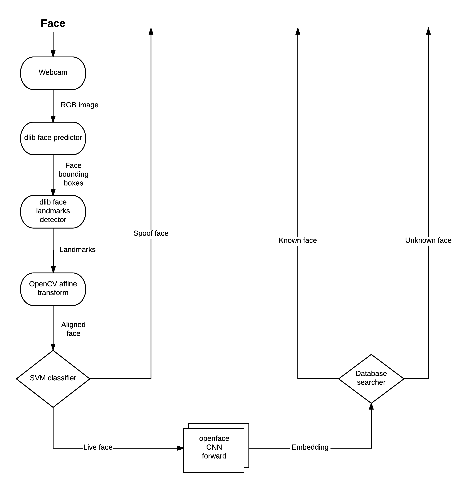

# Face-based authentication with spoof detection

This repository contains the research code and documentation for a face-based authentication system with spoof detection. Most of the code is based on open-source software.

One thing to note here is that the face spoof detector is trained on several public domain databases such as:
 * CASIA face antispoofing database
 * IDIAP Replay-Attack database
 * MSU USSA
 * MSU MFSD

The flow of the application is presented below:

## Instalation instructions

First of all, this is a 3 years old project written in python2 when I was just learning python:) On top of that, has some nasty dependencies like pyvlfeat which I've been trying to install for the last few hours with no luck (tried multiple python versions, it's all broken)

You will need to install openCV, I notice it's easier through conda to install it.

Other dependencies are in the requirements.txt file.

## How to Run

The entry point of the demo is `face_auth_app.py` while the main code of the app is in `src/faceSpoofDetection/`.

`face_auth_app.py` it's loading a pretrained SVM classifier that is not provided in the repo so you would have to train it yourself. 
In order to do so, in `src/faceSpoofDetection/SVMClassifier` the `powerfull_classifier.py` script trains a classifier on all 4 databases used in this research project. That is a good start point for this.
